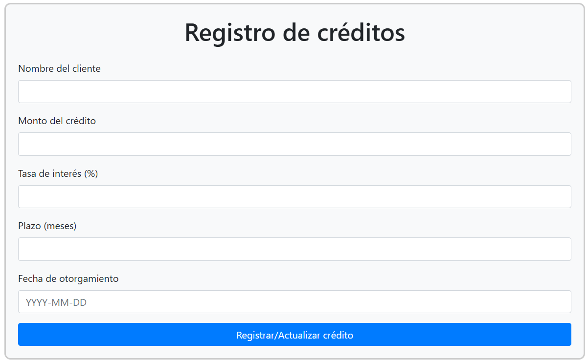
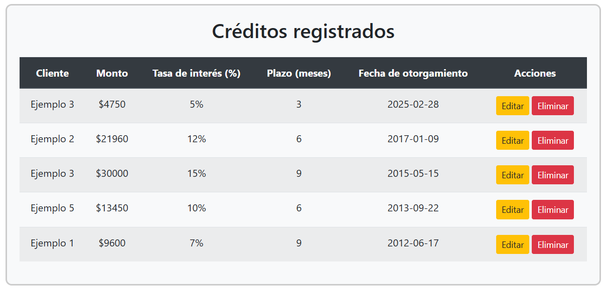
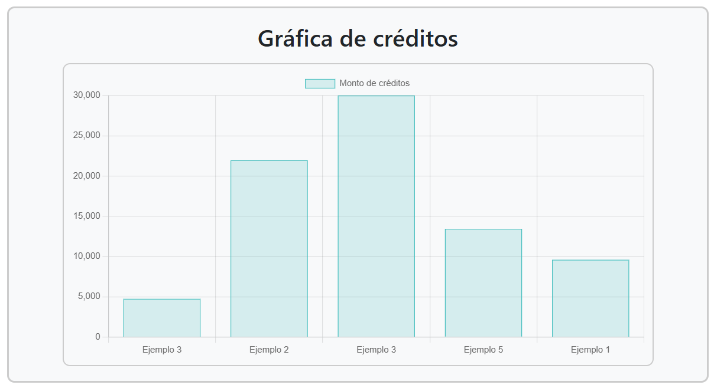
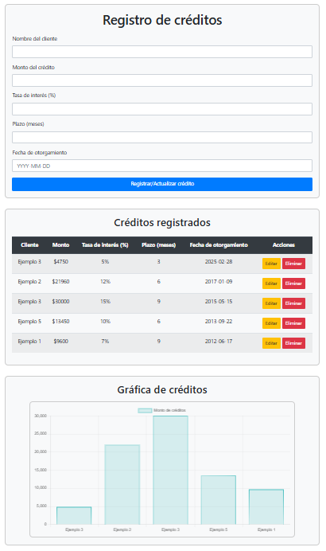

# Sistema de registro de créditos
Herramienta web desarrollada con Python - Flask, que permite registrar, visualizar, editar y eliminar créditos otorgados a clientes. También incluye una gráfica dinámica que muestra el total de créditos otorgados por cliente.

## Características
- Registro de créditos con los siguientes datos:
  - Nombre del cliente
  - Monto del crédito
  - Tasa de interés
  - Plazo en meses
  - Fecha de otorgamiento
- Listado de créditos registrados en una tabla
- Edición y eliminación de créditos
- Gráfica interactiva del total de créditos otorgados

## Tecnologías utilizadas
- **Backend**: Flask (Python)
- **Base de datos**: SQLite
- **Frontend**: HTML, CSS, JavaScript (Bootstrap, Chart.js)
- **Gráfica**: Chart.js para la visualización de los créditos
- **Flask-SQLAlchemy**: ORM para manejar la base de datos SQLite
- **Flask-CORS**: Para permitir el acceso desde el frontend

## Requisitos previos
Antes de ejecutar el proyecto, debe de estar instalado:
- **Python 3.7+**
- **pip** (administrador de paquetes de Python)
- **SQLite** (para la base de datos)

## Instalación
1. **Clonar el repositorio**

       git clone https://github.com/AxelRmn/HerramientaCreditos.git
   
       cd HerramientaCreditos

2. **Crear un entorno virtual (opcional pero recomendado)**

        -m venv venv

3. **Activar el entorno virtual**

    En Windows:
   
        venv\Scripts\activate
   
    En macOS y Linux:
   
        source venv/bin/activate

4. **Instalar dependencias**

       pip install -r requirements.txt
   

## Uso
1. **Ejecutar la aplicación**

       python app.py

2. **Abrir en el navegador**

    Accede a la aplicación desde:
    http://127.0.0.1:5000

## Estructura del proyecto
    /HerramientaCreditos
    │── app.py                # Archivo principal que inicia la aplicación
    │── database.py           # Configuración de la base de datos
    │── routes.py             # Definición de las rutas y lógica de la API
    │── requirements.txt      # Lista de dependencias necesarias
    │── README.md             # Documentación del proyecto
    │── templates/
    │   └── index.html          # Interfaz web de la aplicación
    │── images/               # Imágenes de la interfaz web

## Posibles errores y soluciones
1. Error de dependencias
**Problema:** Módulos de Python no encontrados.
**Solución:** Ejecutar `pip install -r requirements.txt`.

2. Error de base de datos
**Problema:** `sqlite3.OperationalError: no such table: creditos`.
**Solución:** Asegurarse de que `database.db` está creado. Si no, eliminarlo y volver a ejecutar `app.py`.

3. Formato incorrecto en la fecha
**Problema:** Se muestra `DD-MM-YYYY` en lugar de `YYYY-MM-DD`.
**Solución:** Confirmar que `index.html` usa `pattern="\d{4}-\d{2}-\d{2}"` y que `routes.py` almacena la fecha como `String` en lugar de `Date`.

## Imágenes de interfaz

1. Registro de créditos  
  

2. Lista de créditos registrados  
  

3. Gráfica de créditos registrados  
  

4. Interfaz completa  

